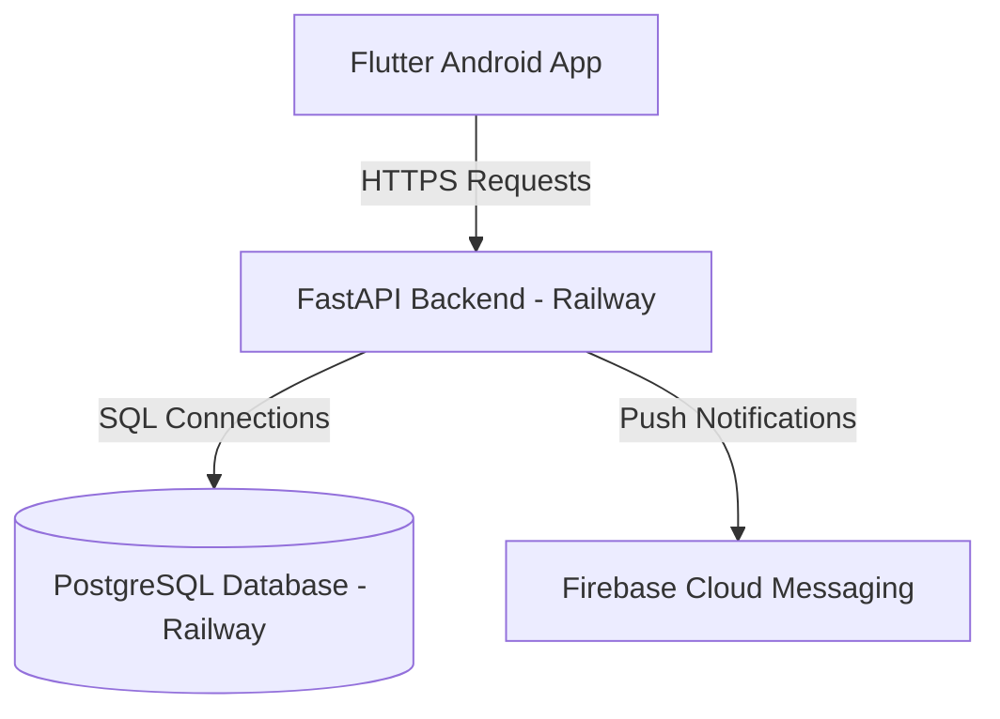

# VisaNotify Railway Deployment Guide

This guide describes how to migrate the VisaNotify backend to Railway and configure the Flutter Android app to connect to the cloud.

---

## 1. Cloud Architecture



- **FastAPI Backend Service**: Runs continuously in a Docker container on Railway.
- **PostgreSQL Database Service**: Provided by Railway to persist user and application data.
- **Background Scheduler**: Runs inside the FastAPI process, downloading the visa decisions CSV and triggering FCM notification updates every few hours.

---

## 2. Setting Up Railway Services

1. Log in to [Railway](https://railway.app/).
2. Create a new project.
3. Add a **PostgreSQL** database service to the project.
4. Add a **Web Service** by linking your GitHub repository and pointing it to the `backend_claude` directory.

---

## 3. Required Environment Variables

Configure the following variables in the **Variables** tab of your Railway backend service:

| Variable Name | Description | Example Value |
|---|---|---|
| `DATABASE_URL` | Automatically injected by Railway when linking the database service | `postgresql://postgres:...` |
| `SECRET_KEY` | Long, secure random secret key for JWT token signatures | `your-long-random-jwt-signing-secret` |
| `BACKEND_CORS_ORIGINS` | Comma-separated list of allowed web origins | `https://your-custom-frontend.domain` |
| `FIREBASE_CREDENTIALS_JSON` | The full JSON content of your Firebase Admin service account key | `{"type": "service_account", ...}` |
| `ADMIN_EMAILS` | Comma-separated list of user emails authorized to manually run visa checks | `admin@visanotify.com,dev@visanotify.com` |
| `IRELAND_VISA_CSV_URL` | Override for the CSV data source URL | `https://raw.githubusercontent.com/...` |
| `SCHEDULER_INTERVAL_HOURS` | Frequency of background check cycles (default: 6) | `6` |

---

## 4. Database Migration Procedure

To migrate your local PostgreSQL database to the new Railway database:

### Step A: Export Local Data
Run this command from your local machine to export a custom-format dump of your local database (`visanotify`):
```cmd
set PGPASSWORD=postgre123
pg_dump -h localhost -U postgres -d visanotify -F c -b -v -f visanotify_backup.dump
```

### Step B: Restore to Railway
Retrieve your Railway database connection variables (Host, Port, User, Database name, and Password) from the Railway Dashboard, then run:
```cmd
set PGPASSWORD=YOUR_RAILWAY_PG_PASSWORD
pg_restore -h YOUR_RAILWAY_PG_HOST -p YOUR_RAILWAY_PG_PORT -U YOUR_RAILWAY_PG_USER -d YOUR_RAILWAY_PG_DATABASE -v --no-owner --no-privileges visanotify_backup.dump
```
> [!NOTE]
> Since this backup includes the `alembic_version` table, the database migration state is preserved. When the FastAPI container starts, `alembic upgrade head` will detect that your schema is already up to date and won't throw collisions or create duplicate tables.

---

## 5. Firebase Credentials Setup

1. Go to the [Firebase Console](https://console.firebase.google.com/).
2. Navigate to **Project Settings** > **Service Accounts**.
3. Click **Generate New Private Key**.
4. Open the downloaded JSON file and copy its entire text.
5. Create a new variable in your Railway service named `FIREBASE_CREDENTIALS_JSON` and paste the text as the value.

---

## 6. Building the Flutter App for Production

To build the Flutter Android app targeting the new cloud URL, use the `--dart-define` option during build:

```bash
flutter build apk --release --dart-define=API_BASE_URL=https://YOUR-RAILWAY-SERVICE-DOMAIN/api/v1
```

Or run the app directly targeting the cloud service during development:
```bash
flutter run --dart-define=API_BASE_URL=https://YOUR-RAILWAY-SERVICE-DOMAIN/api/v1
```

---

## 7. How to Switch Between Local and Cloud

- **To target Local Backend (via ngrok)**: Simply build or run the Flutter app without passing `--dart-define=API_BASE_URL`. It will automatically fall back to your existing ngrok tunnel:
  `https://student-theft-rockband.ngrok-free.dev/api/v1`
- **To target Railway Backend**: Pass the `--dart-define` parameter pointing to your Railway domain:
  `--dart-define=API_BASE_URL=https://YOUR-RAILWAY-SERVICE-DOMAIN/api/v1`

---

## 8. Health Checks and Troubleshooting

- **Health check URL**: `https://YOUR-RAILWAY-SERVICE-DOMAIN/health` (should return `{"status": "ok"}`).
- **Logs**: Monitor Railway's deploy and application logs if you encounter issues. If Firebase fails to initialize, verify that the `FIREBASE_CREDENTIALS_JSON` contains valid, complete JSON.
- **Rollback**: To rollback, redeploy a previous build on Railway or stop the service. Local development scripts (`start_backend_ngrok.ps1` and `.env`) remain untouched and continue to function exactly as before.
